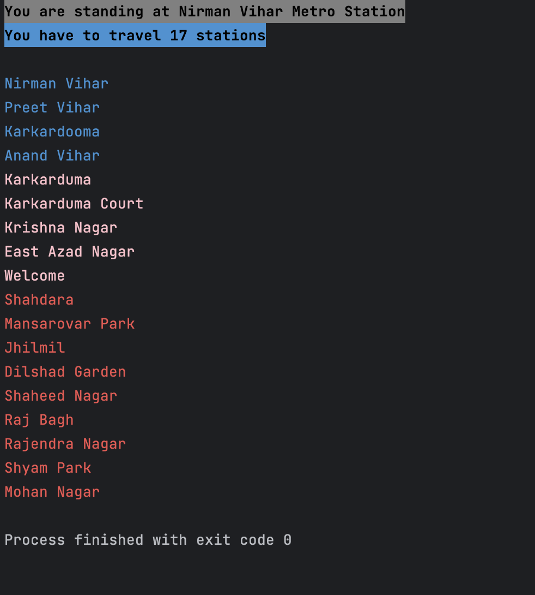

# DelhiMetro-Graph

## Introduction
This project is an implementation of a graph data structure to represent the Delhi Metro Network. The graph is implemented using a HashMap.

## How to use
- Clone the repository.
- Run the following commands in the terminal:
```
cd DelhiMetro-Graph
javac *.java
java Client
```

## Features
- The graph is implemented using a HashMap.
- The graph is undirected and weighted.

## Output


## Future Scope
- Add more features to the graph.
- Add GUI to the project.
- Add CLI to the project.
- Add more cities to the project.